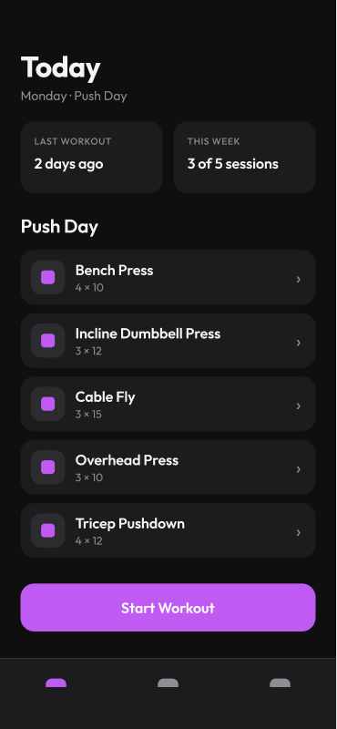

# 01 · Today Screen

[Open in Figma](https://www.figma.com/design/BsnpCvN6adkuJKovpr7PUO?node-id=1-2)

## Layout

- Header: "Today" title + "Monday · Push Day" subtitle
- Stats row: "Last Workout" and "This Week" cards
- "Push Day" section header
- Exercise list (5 cards): icon box, name, sets×reps, chevron
  - Bench Press 4×10
  - Incline Dumbbell Press 3×12
  - Cable Fly 3×15
  - Overhead Press 3×10
  - Tricep Pushdown 4×12
- "Start Workout" accent button (full width)
- Bottom nav: Today (active) / Progress / Profile

## Notes for implementation

- Tapping an exercise card → ExerciseDetailScreen
- "Start Workout" → begins timer, navigates to ActiveWorkoutScreen
- Rest day / no routine state: replace exercise list with a friendly message
  and a "Log anyway" button
