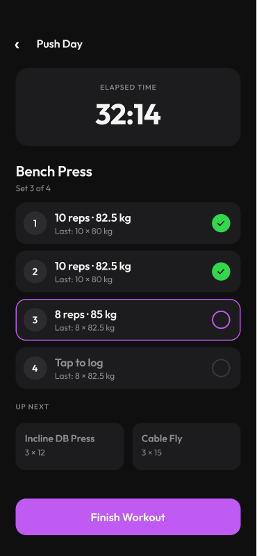

# 02 · Active Workout Screen

[Open in Figma](https://www.figma.com/design/BsnpCvN6adkuJKovpr7PUO?node-id=3-2)

## Layout

- Back chevron + "Push Day" title
- Timer card: "ELAPSED TIME" / "32:14"
- Current exercise: "Bench Press" + "Set 3 of 4"
- Set rows (4) with three states:
  - Done: green checkmark
  - Current: accent-outlined, editable
  - Pending: divider-outlined, ghost "Last:" hint text
- "UP NEXT" section: next 2 exercises as preview cards
- "Finish Workout" accent button (full width)

## Notes for implementation

- Set rows show inline reps + weight inputs when current
- "Last:" ghost text is pulled from the most recent WorkoutLog for that
  exercise/set
- "Finish Workout" saves the WorkoutLog and shows a summary
