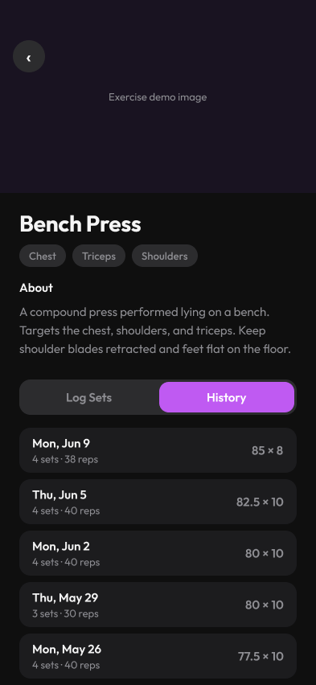

# 03 · Exercise Detail Screen

[Open in Figma](https://www.figma.com/design/BsnpCvN6adkuJKovpr7PUO?node-id=5-2)

## Layout

- Hero image (WGER exercise image, `cached_network_image` + skeleton loader)
- Back button overlay
- Exercise name: "Bench Press"
- Muscle group chips: Chest, Triceps, Shoulders
- "About" section: WGER description text
- Segmented control: "Log Sets" / "History"
- History list (5 rows): date, sets/reps summary, top set

## Notes for implementation

- "Log Sets" tab reuses the same inline set-logging inputs as Active Workout
- "History" tab queries the last 5 WorkoutLogs containing this exercise
- Hero image falls back to a placeholder if WGER has no image for the exercise
