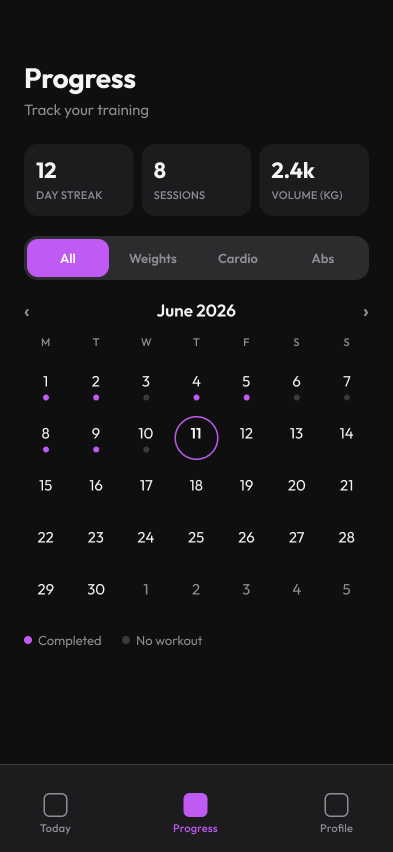

# 04 · Progress Screen

[Open in Figma](https://www.figma.com/design/BsnpCvN6adkuJKovpr7PUO?node-id=11-2)

## Layout

- Header: "Progress" title + "Track your training" subtitle
- Stats strip (3 cards): day streak, sessions this month, total volume
- Filter segmented control: All / Weights / Cardio / Abs
- Month navigation: "‹ June 2026 ›"
- Calendar grid: weekday header + 5-week grid
  - Purple dot = completed workout
  - Gray dot = no workout
  - Accent ring = today
  - Muted numbers = days outside the current month
- Legend: "Completed" / "No workout"
- Bottom nav: Today / Progress (active) / Profile

## Notes for implementation

- Tapping a day with a workout → bottom sheet with that day's summary
- Filter segmented control narrows the calendar dots + stats to a specific
  exercise type
- Stats strip recalculates based on the active filter
